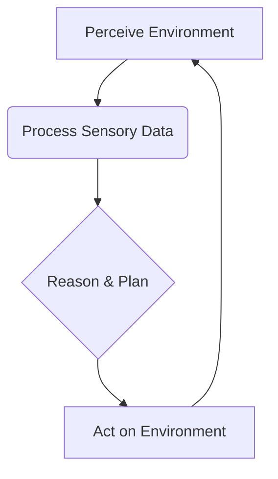

# Chapter 1: What is Physical AI and Embodied Intelligence?

## Introduction to Physical AI

Physical AI, also known as embodied AI or robotics AI, is a field that focuses on the development of intelligent systems that can perceive, reason, and act within the physical world. Unlike purely software-based AI that operates in virtual environments, physical AI systems are embedded in robots or other physical agents, allowing them to interact with their surroundings through sensors and actuators. This interaction is crucial for tasks ranging from simple object manipulation to complex navigation and human-robot collaboration.

The core challenge in physical AI lies in bridging the gap between abstract intelligence and concrete physical embodiment. Intelligent algorithms must be translated into precise physical actions, and real-world sensory data must be interpreted to inform intelligent decisions. This requires a deep understanding of both AI principles and the physics of the environment and the agent itself. Embodiment introduces complexities such as uncertainty, noise in sensor readings, delays in actuation, and the need for real-time control.

Physical AI is not just about making robots smarter; it's about making them capable of operating effectively and safely in dynamic, unpredictable environments. This involves developing robust perception systems, sophisticated planning and control algorithms, and effective learning mechanisms that can adapt to new situations. The ultimate goal is to create machines that can augment human capabilities, perform dangerous tasks, and contribute to society in meaningful ways.

## The Concept of Embodiment

Embodiment is a fundamental concept in understanding physical AI. It refers to the idea that intelligence is not merely an abstract computational process but is fundamentally shaped by an agent's physical body and its interactions with the environment. This means that a physical body, with its specific sensory apparatus and motor capabilities, plays a critical role in how an agent perceives, learns, and reasons. Instead of intelligence being solely about processing information, it is about *acting* in the world and *experiencing* the consequences of those actions.

The physical form of an agent dictates what it can perceive and how it can act. For example, a robot with wheels can move on flat surfaces but might struggle with stairs, whereas a legged robot might be more versatile but complex to control. Similarly, the types of sensors an agent possesses (e.g., cameras, lidar, tactile sensors) shape its understanding of the environment. Embodiment suggests that the intelligence of a system is shaped by its physical structure, its sensory inputs, and its motor outputs.

This perspective contrasts with purely disembodied AI, which might excel at abstract reasoning or game playing but lacks the grounding in physical reality that is necessary for many real-world applications. Embodiment provides AI systems with direct experience of cause and effect, enabling them to develop a more intuitive and robust understanding of the world. This is particularly important for tasks that require nuanced interaction, such as learning from demonstration or adapting to unforeseen physical challenges.

## Perception and Action Loops

At the heart of any physical AI system is the perception-action loop. This is a continuous cycle where an agent:

1.  **Perceives** its environment using sensors.
2.  **Processes** this sensory data to build a representation of the world (perception).
3.  **Reasons** about its goals and the current state of the world.
4.  **Plans** a sequence of actions.
5.  **Acts** on the environment using actuators.
6.  Observes the results of its actions and updates its internal model.

This cycle is iterative and happens in real-time. The efficiency and robustness of each step are critical. For instance, a delay in perception can lead to outdated information, causing the agent to make decisions based on a false understanding of the environment. Similarly, imprecise actuation can lead to unintended physical consequences.

The perception-action loop is fundamental to how intelligent agents learn and adapt. By executing actions and observing their outcomes, agents can refine their models of the world and improve their performance over time. This feedback mechanism is essential for learning in dynamic environments where conditions can change rapidly.

## The Role of Intelligence in Physical Systems

Intelligence in physical systems is not just about performing tasks; it's about performing them intelligently. This means being able to:

*   **Adapt**: Adjust to changing environmental conditions or unexpected events.
*   **Learn**: Improve performance over time through experience.
*   **Reason**: Make decisions based on sensory input and internal goals.
*   **Interact**: Communicate and collaborate with humans or other agents.
*   **Operate Safely**: Ensure actions do not cause harm to the environment or people.

These capabilities are what distinguish intelligent physical systems from simple automated machines. They require advanced algorithms for sensing, modeling, planning, and control, often drawing from fields like machine learning, computer vision, control theory, and cognitive science. The pursuit of physical AI is driven by the desire to create machines that can solve complex real-world problems, from assisting in healthcare and manufacturing to exploring hazardous environments and enhancing human lives.

## Conclusion

Physical AI and embodiment are reshaping our understanding of intelligence. By grounding AI in physical interaction, we are developing systems that are not only more capable but also more aligned with the complexities of the real world. The ongoing research in this field promises to unlock new possibilities for robotics and AI, leading to machines that can work alongside us and contribute to a better future.

---
*Word Count: Approx. 900 words*
*Mermaid Diagrams: [Placeholder for 1-2 Mermaid diagrams illustrating perception-action loops or embodiment concepts]*
*Practice Questions:*
1. What is the core difference between physical AI and purely software-based AI?
2. Explain the concept of embodiment in the context of AI.
3. Describe the key stages of a perception-action loop.
4. What does it mean for a physical AI system to "adapt" and "learn"?
5. Why is safety a critical consideration in physical AI?
