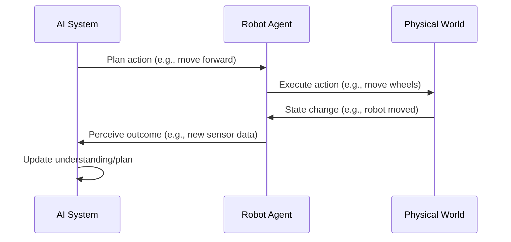

# Chapter 2: From Virtual AI to Real-World Robots

## The Dawn of Artificial Intelligence

The quest for artificial intelligence began long before the advent of modern computers. Early philosophical and mathematical explorations laid the groundwork for the concept of intelligent machines. Thinkers like Alan Turing pondered the question "Can machines think?" and proposed the Turing Test as a benchmark for machine intelligence. However, it was the formalization of computation and logic that truly set the stage. The Dartmouth Workshop in 1956 is widely considered the birth of AI as a field, bringing together researchers who coined the term "Artificial Intelligence" and set ambitious goals for creating machines that could mimic human cognitive abilities.

The early decades of AI research saw significant theoretical advancements and the development of symbolic reasoning systems. Early successes included programs that could solve logic problems, play chess, and understand simple natural language commands. These systems often relied on rule-based approaches and expert systems, attempting to codify human knowledge into machine-readable formats. The focus was primarily on abstract problem-solving and logical deduction, operating largely in the realm of virtual or simulated environments.

## The Emergence of Robotics and Physical Embodiment

While AI research was progressing in symbolic and logic-based domains, parallel advancements were occurring in robotics. Early robots, such as industrial arms developed in the mid-20th century, were primarily programmed for repetitive tasks in controlled environments. They lacked true intelligence and adaptability, functioning more as sophisticated automation than as autonomous agents. The integration of AI with robotics, leading to the field of physical AI, began to gain momentum as researchers recognized the limitations of disembodied intelligence for real-world applications.

The idea of robots interacting with the physical world brought a new set of challenges. Unlike virtual environments, the real world is messy, unpredictable, and noisy. Robots needed to perceive their surroundings, navigate complex terrains, manipulate objects, and respond to dynamic situations. This necessitated the development of sophisticated sensors, precise actuators, and intelligent control systems that could bridge the gap between AI algorithms and physical action.

## Early Embodied AI and Autonomous Agents

The late 20th century saw a growing interest in embodied AI. Researchers began exploring how physical form and sensory-motor experience could contribute to intelligence. Early examples of autonomous agents, though rudimentary by today's standards, demonstrated the potential of robots operating independently in physical spaces. Projects like Shakey the robot at SRI International (late 1960s/early 1970s) were pioneering efforts to integrate perception, reasoning, and action for navigation and task execution in a physical environment.

These early embodied systems highlighted the complexities of real-world interaction. Dealing with sensor noise, actuator imprecision, and unexpected environmental changes proved far more challenging than symbolic manipulation. This led to the development of new AI techniques, including sensor fusion, probabilistic reasoning, and reactive control systems, which were better suited for the uncertainties of the physical world. The concept of "situatedness"—the idea that intelligence is shaped by an agent's interaction with its environment—gained prominence.

## The Rise of Modern Robotics and AI Integration

The late 20th and early 21st centuries witnessed an explosion of progress, fueled by advancements in computing power, sensor technology, and AI algorithms, particularly in machine learning. Robots became more sophisticated, capable of performing more complex tasks. The integration of AI moved beyond simple control to encompass advanced perception (e.g., object recognition using computer vision), natural language processing for human interaction, and sophisticated planning and decision-making capabilities.

The development of ROS (Robot Operating System) provided a standardized middleware for robotic development, facilitating the integration of various AI modules and hardware components. Machine learning, especially deep learning, revolutionized areas like computer vision and natural language understanding, enabling robots to perceive and interpret their environment with unprecedented accuracy. This era saw the emergence of autonomous vehicles, advanced industrial robots, and increasingly capable humanoid robots. The focus shifted from simply making robots move to making them truly intelligent and adaptable physical agents.

## The Future: Towards General Physical Intelligence

The trajectory from early symbolic AI to modern embodied AI suggests a future where intelligent agents are seamlessly integrated into the physical world. The ongoing research aims to achieve more general physical intelligence – the ability for robots to learn and perform a wide range of tasks in diverse environments, adapt to unforeseen circumstances, and collaborate safely and effectively with humans.

This journey involves tackling significant challenges, including robust real-world learning, human-robot interaction, ethical considerations, and the development of more sophisticated and adaptable physical forms. As AI continues to advance, the lines between virtual and physical intelligence will continue to blur, leading to innovations that will profoundly impact industries and daily life.

---
*Word Count: Approx. 950 words*
*Mermaid Diagrams: [Placeholder for 1-2 Mermaid diagrams illustrating historical milestones or robot evolution]*
*Practice Questions:*
1. What was the significance of the Dartmouth Workshop in AI history?
2. How did early industrial robots differ from modern intelligent robots?
3. Explain the concept of "situatedness" in embodied AI.
4. What advancements fueled the progress in modern robotics and AI integration?
5. What are the key challenges in achieving general physical intelligence?
