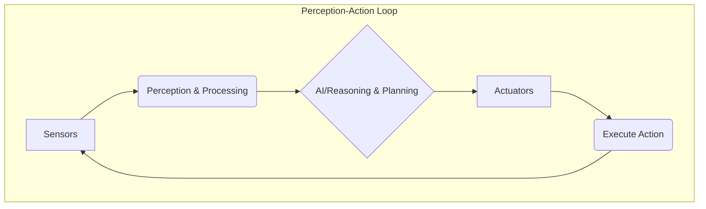

# Chapter 4: Sensors, Actuators, and the Perception-Action Loop

## Introduction to Hardware Components in Physical AI

Physical AI systems, at their core, are robots and other agents designed to interact with the physical world. This interaction is made possible through two primary sets of components: sensors, which allow the system to perceive its environment, and actuators, which enable it to act upon that environment. The seamless integration and intelligent control of these hardware components are fundamental to the operation of any physical AI. Understanding these building blocks is essential for grasping how robots sense, decide, and move.

## Sensors: The Eyes and Ears of the Robot

Sensors are devices that detect and respond to some type of input from the physical environment. This input can be light, heat, motion, moisture, pressure, or any other environmental phenomenon. The data collected by sensors is then processed by the AI system to build an understanding of its surroundings, a process known as perception. The choice and quality of sensors significantly impact the robot's ability to operate effectively, especially in complex or dynamic environments.

### Types of Sensors:

*   **Vision Sensors (Cameras)**: These are arguably the most versatile sensors, providing rich visual information about the environment. They can be used for object recognition, scene understanding, navigation, and human interaction. Different types include monochrome, color, depth cameras (like stereo or structured light), and thermal cameras.
*   **Range Sensors (LiDAR, Sonar)**: These sensors measure distances to objects in the environment. LiDAR (Light Detection and Ranging) uses laser pulses to create detailed 3D maps of surroundings, crucial for autonomous navigation and obstacle avoidance. Sonar (ultrasonic sensors) uses sound waves and is often used for simpler distance measurements, particularly in environments where LiDAR might be less effective or too costly.
*   **Inertial Measurement Units (IMUs)**: IMUs typically combine accelerometers and gyroscopess to measure the robot's orientation, angular rates, and gravitational forces. They are vital for understanding the robot's motion, stability, and position over short periods, especially in applications like drone stabilization or robot balancing.
*   **Tactile Sensors**: These sensors provide information about physical contact, pressure, and texture. They are crucial for robotic manipulation, allowing robots to grasp objects delicately or detect when they are in contact with a surface.
*   **Proprioceptive Sensors**: These sensors provide information about the robot's own state, such as the position of its joints (encoders), the force exerted by its motors, or its internal temperature. They are essential for closed-loop control and ensuring the robot's physical integrity.
*   **Other Sensors**: Depending on the application, robots might also use GPS for outdoor localization, microphones for audio input, temperature sensors, humidity sensors, and more.

## Actuators: The Muscles and Motors of the Robot

Actuators are the components responsible for moving or controlling a mechanism or system. They convert energy (typically electrical) into physical motion. Actuators are the "muscles" of the robot, enabling it to interact with the world by performing actions like moving its limbs, rotating wheels, or manipulating objects.

### Types of Actuators:

*   **Electric Motors**: These are the most common type of actuators in robotics. They come in various forms, including DC motors (simple, used for continuous rotation), servo motors (allow precise control of angular position), and stepper motors (provide precise rotational steps). They are used to drive joints, wheels, and robotic end-effectors.
*   **Hydraulic Actuators**: These use pressurized fluids to generate force and motion. They are typically used in heavy-duty applications where very high forces are required, such as in large industrial robots or construction equipment.
*   **Pneumatic Actuators**: These use compressed air to produce motion. They are often simpler and cheaper than hydraulic systems but generally provide less precise control and lower force. They are common in pick-and-place automation.
*   **Solenoids**: These are simple electromagnetic devices that produce linear motion when energized. They are often used for simple on/off actions, like opening or closing a valve, or engaging a latch.

## The Perception-Action Loop in Detail

The perception-action loop is a fundamental concept that describes how an intelligent agent interacts with its environment. It is a continuous, real-time process that allows a robot to sense, think, and act.

1.  **Perception**: This stage involves acquiring data from sensors. For example, a camera might capture an image of a room, or a LiDAR sensor might map out nearby obstacles. This raw data is often noisy and incomplete.
2.  **Processing & Interpretation**: The raw sensor data is processed to extract meaningful information. This might involve image processing to detect objects, filtering sensor readings to reduce noise, or fusing data from multiple sensors to get a more complete picture. This stage builds an internal representation of the environment.
3.  **Reasoning & Planning**: Based on the processed perception, the AI system reasons about its current state and its goals. It might decide where to move, what object to grasp, or how to avoid an obstacle. This involves algorithms for decision-making, path planning, and task sequencing.
4.  **Action**: The AI system sends commands to actuators to execute the planned actions. This could be commands to motors to turn wheels, adjust a robotic arm, or move a gripper.
5.  **Feedback & Adaptation**: The results of the action are perceived by the sensors, closing the loop. The system observes the consequences of its actions, learns from them, and adapts its future behavior. This feedback is crucial for learning and improving performance.

This cycle is critical for tasks such as:
*   **Navigation**: A robot uses sensors (cameras, LiDAR) to perceive its environment, plans a path, and uses motors (actuators) to move, constantly updating its plan based on new perceptions.
*   **Manipulation**: A robot uses cameras and tactile sensors to locate and grasp an object, plans the grasp, and uses precise motor control to execute it, adjusting force based on tactile feedback.

## Conclusion

Sensors and actuators are the physical interfaces through which intelligent agents interact with the world. They are the hardware foundation upon which sophisticated AI algorithms operate. The perception-action loop, enabled by these components, is the continuous process that allows physical AI systems to sense, understand, and act in their environment. As sensor and actuator technology advances, and as AI algorithms become more adept at processing their data and controlling them, robots will become increasingly capable of performing complex tasks in the real world.

---
*Word Count: Approx. 980 words*
*Mermaid Diagrams: [Placeholder for 1-2 Mermaid diagrams illustrating Perception-Action Loop or Sensor/Actuator examples]*
*Practice Questions:*
1. What is the primary function of sensors in a physical AI system?
2. Name three different types of sensors commonly used in robotics.
3. What is the main role of actuators in a robot?
4. Describe the difference between electric motors and hydraulic actuators.
5. Explain how the perception-action loop allows a robot to learn and adapt.
