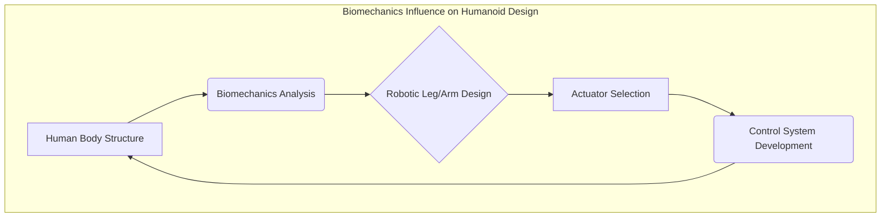

# Chapter 5: Introduction to Humanoid Form Factor

## The Rationale Behind Humanoid Robots

Humanoid robots are designed to resemble the human body in terms of form and function. This resemblance is not merely aesthetic; it is driven by a practical rationale rooted in the idea of operating in human-centric environments and performing tasks that humans currently do. The humanoid form factor offers several advantages, particularly for interaction with human-designed infrastructure and for tasks requiring human-like dexterity and mobility.

The decision to design a robot as humanoid stems from the desire to create machines that can seamlessly integrate into human spaces. Our homes, offices, factories, and public spaces are all built for human bodies. Doors, stairs, tools, and furniture are all designed with human dimensions and capabilities in mind. A humanoid robot, with its bipedal locomotion, articulated arms, and often a head-like sensor suite, is inherently better equipped to navigate and utilize these environments without requiring significant modifications to the infrastructure.

## Advantages of Humanoid Form Factor

The adoption of a humanoid form factor offers several key advantages:

1.  **Environmental Compatibility**: As mentioned, humanoid robots are naturally suited for human environments. They can walk on two legs, use tools designed for human hands, and interact with interfaces meant for humans. This reduces the need for specialized robotic environments.
2.  **Dexterity and Manipulation**: Humanoid robots, with their articulated arms and hands, can potentially achieve a high degree of dexterity. This allows them to perform complex manipulation tasks, from delicate assembly to handling diverse objects, mirroring human capabilities.
3.  **Mobility**: Bipedal locomotion, while challenging to master, offers advantages in navigating cluttered or uneven terrains where wheeled robots might fail. The ability to step over obstacles, climb stairs, and maintain balance in dynamic situations is a significant advantage.
4.  **Social Interaction**: A human-like form can facilitate more natural and intuitive social interaction with humans. For roles in healthcare, elder care, or customer service, a robot that looks and moves somewhat like a human might be perceived as more approachable and easier to communicate with.
5.  **Task Transferability**: Many human tasks, particularly those involving manipulation and interaction, can potentially be transferred to humanoid robots, reducing the need for costly re-engineering of tasks or environments.

## Challenges in Humanoid Robot Design

Despite the advantages, designing and building effective humanoid robots presents immense challenges:

*   **Bipedal Locomotion**: Maintaining balance and achieving stable, efficient walking is a formidable task. It requires sophisticated control systems that can react to uneven surfaces, recover from perturbations, and adapt to different speeds and gaits.
*   **Dexterous Manipulation**: Replicating the fine motor skills and dexterity of the human hand is extremely difficult. Designing hands that can grasp a wide variety of objects with appropriate force and precision is an ongoing area of research.
*   **Power and Energy Efficiency**: Bipedal locomotion and complex manipulation are energy-intensive. Providing sufficient power for extended operation while managing heat dissipation and weight is a significant engineering challenge.
*   **Sensing and Perception**: Humanoid robots need to perceive their environment comprehensively, often requiring a suite of sensors similar to human senses (vision, hearing, touch) and integrating this information effectively.
*   **Human-Robot Interaction (HRI)**: Ensuring safe, natural, and effective interaction with humans requires advanced capabilities in social intelligence, natural language understanding, and predictive modeling of human behavior.
*   **Cost**: The complexity of humanoid robot design and manufacturing currently makes them very expensive, limiting widespread adoption.

## Biomechanics and Humanoid Design

Biomechanics, the study of the mechanical laws relating to the movement or structure of living organisms, heavily influences humanoid robot design. Understanding human anatomy, gait, balance, and muscle function provides blueprints and inspiration for creating robotic equivalents. For instance, studying the human leg and foot structure informs the design of robotic legs for stable and efficient walking. Similarly, the mechanics of the human arm and shoulder are studied to create robotic arms with a wide range of motion and dexterity.

The concept of "dynamic balance" is crucial. Unlike static balancing, where an object is simply kept upright, dynamic balance involves continuous adjustments to maintain equilibrium while moving. Humanoids must constantly monitor their center of gravity and make rapid adjustments to their limbs and body posture to remain upright, especially when walking or interacting with external forces. This often involves sophisticated algorithms and fast-acting actuators.

## Applications and Future Prospects

Humanoid robots are being developed for a wide range of applications, including:

*   **Assistance and Caregiving**: Robots that can assist the elderly or people with disabilities in their daily lives.
*   **Exploration**: Robots designed to operate in environments too dangerous or inaccessible for humans, such as disaster zones or space.
*   **Manufacturing and Logistics**: Robots that can perform complex assembly tasks or handle goods in warehouses.
*   **Research Platforms**: Humanoids serve as invaluable platforms for advancing AI research, particularly in areas like locomotion, manipulation, and HRI.

The future of humanoid robots promises machines that are not only more capable and versatile but also more integrated into our daily lives. As challenges in locomotion, manipulation, power, and AI are overcome, humanoids could become indispensable partners in various aspects of society.

## Conclusion

The humanoid form factor is a compelling design choice for robots intended to operate in human environments and perform human-like tasks. While significant engineering and AI challenges remain, the inherent advantages in environmental compatibility, potential dexterity, and natural interaction continue to drive innovation in this field. Understanding the biomechanical principles and the paradoxes of AI development, as highlighted by Moravec's Paradox, is essential for the continued progress towards truly intelligent and useful humanoid robots.

---
*Word Count: Approx. 920 words*
*Mermaid Diagrams: [Placeholder for 1-2 Mermaid diagrams illustrating biomechanical principles or robot interaction]*
*Practice Questions:*
1. What is the primary practical motivation for designing humanoid robots?
2. Name two key advantages of the humanoid form factor.
3. What are three significant challenges in designing effective humanoid robots?
4. How does biomechanics influence the design of humanoid robots?
5. What does "dynamic balance" mean in the context of bipedal locomotion?