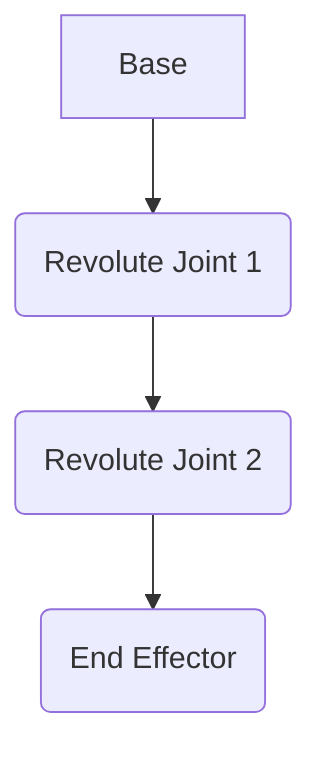

--- 
id: 'chapter-1-dof-joint-types'
title: Degrees of Freedom and Joint Types
sidebar_label: "Chapter 1: DOF & Joints"
week: 'Weeks 3–5'
tags: [robotics, kinematics, DOF, joints]
---

# Degrees of Freedom and Joint Types

## Introduction

This chapter introduces the fundamental concepts of Degrees of Freedom (DOF) and various types of joints used in robotic systems. Understanding these concepts is crucial for describing robot configurations, analyzing their motion, and controlling their behavior.

## 1. What are Degrees of Freedom (DOF)?

A degree of freedom (DOF) represents an independent means by which a dynamic system can move or be configured. For a robotic manipulator, each joint that can be independently controlled contributes to the system's total DOF.

### 1.1. DOF in General Systems

*   A point in 3D space has 6 DOF (3 translational, 3 rotational).
*   A rigid body in space has 6 DOF.

### 1.2. DOF in Robotic Manipulators

*   The number of DOFs determines the robot's mobility and dexterity.
*   A robot with N DOFs can reach any position and orientation within its workspace, provided the DOFs are chosen appropriately.

## 2. Types of Robotic Joints

Robotic joints are the critical elements that provide mobility to a manipulator. They are classified based on the type of motion they enable.

### 2.1. Prismatic Joints (Linear Motion)

*   Allow only translational movement along a single axis.
*   Represented as a sliding or prismatic motion.

### 2.2. Revolute Joints (Rotational Motion)

*   Allow only rotational movement around a single axis.
*   Represented as a twisting or revolute motion.

### 2.3. Other Joint Types (Briefly)

*   Screw joints, cylindrical joints, spherical joints, etc., can be represented as combinations of prismatic and revolute motions.

## 3. Joint Parameters and Representation

Describing joint states is fundamental for robot kinematics.

### 3.1. Joint Variables

*   For revolute joints, the variable is the joint angle ($\theta$). 
*   For prismatic joints, the variable is the joint displacement ($d$). 

### 3.2. Joint Limits

*   Physical robots have limits on their joint ranges to prevent damage.
*   These limits are crucial for planning safe movements.

## 4. Visualizing DOFs and Joints

*(Placeholder for Mermaid diagram showing a simple 2-DOF planar arm)*



## 5. Python Code Examples

Here's a Python snippet to represent a simple joint:

```python
class Joint:
    def __init__(self, type, limits, initial_value):
        self.type = type  # 'revolute' or 'prismatic'
        self.limits = limits # tuple (min, max)
        self.value = initial_value # current angle or displacement

    def set_position(self, value):
        if self.limits[0] <= value <= self.limits[1]:
            self.value = value
        else:
            print(f"Warning: Value {value} is outside joint limits {self.limits}")

# Example usage
shoulder_joint = Joint(type='revolute', limits=(-3.14, 3.14), initial_value=0)
shoulder_joint.set_position(1.57)
print(f"Shoulder joint position: {shoulder_joint.value}")
```

## 6. ROS 2 Snippets

*(Placeholder for ROS 2 concepts related to joint states or URDF definitions)*

```python
# Example: Conceptual ROS 2 message for joint state (simplified)
from sensor_msgs.msg import JointState

joint_state_msg = JointState()
joint_state_msg.name = ['shoulder_pan_joint', 'shoulder_lift_joint']
joint_state_msg.position = [0.0, 0.0] # radians
joint_state_msg.velocity = [0.0, 0.0]
joint_state_msg.effort = [0.0, 0.0]
```

## Practice Questions

1.  Define the term "Degrees of Freedom" in the context of a robotic arm.
2.  What is the difference between a revolute joint and a prismatic joint?
3.  Why are joint limits important in robotics?
4.  How many DOFs does a simple 2D planar arm with two revolute joints have?
5.  Describe a scenario where a robot might need more than 6 DOFs.
6.  What is the primary role of a joint variable (e.g., angle or displacement)?