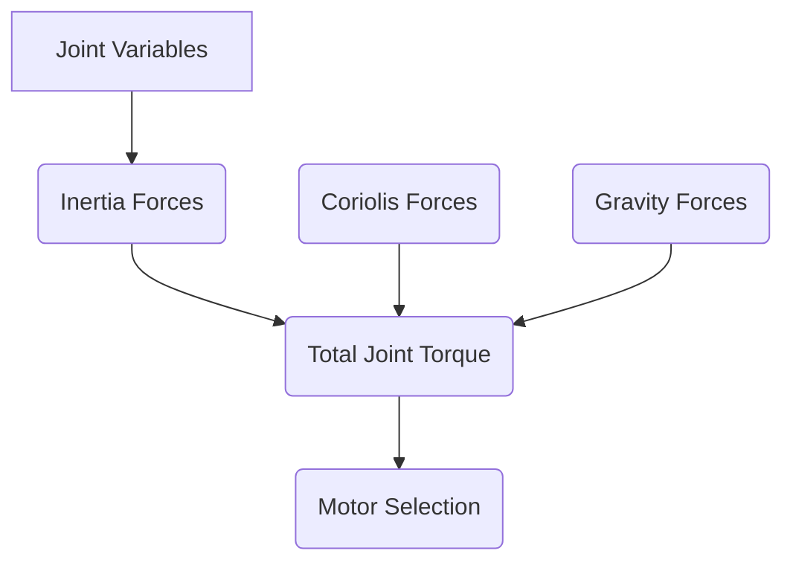

# Dynamics, Torque, and Motor Sizing in Robotics

## Introduction

This chapter explores the dynamics of robotic manipulators, focusing on the forces and torques involved in motion, and the principles of selecting appropriate motors and actuators. Understanding these aspects is crucial for designing robots that can perform tasks efficiently, accurately, and safely.

## 1. Robot Dynamics

Robot dynamics describes the relationship between the forces/torques applied to a robot and its resulting motion. It's essential for control system design, simulation, and predicting robot behavior under load.

### 1.1. Lagrangian Dynamics

*   A common method for deriving equations of motion.
*   Involves calculating kinetic and potential energies of the robot links.

### 1.2. Newton-Euler Formulation

*   An iterative method that calculates forces and torques link by link.
*   Often computationally efficient for real-time control.

## 2. Torques and Forces

Understanding the torques and forces at each joint is critical for actuator selection and control.

### 2.1. Joint Torques

*   Torques required to overcome inertia, gravity, Coriolis/centripetal forces, and external forces.
*   These torques vary with the robot's configuration and desired motion.

### 2.2. Forces

*   Forces acting on the end-effector and throughout the links.
*   Important for tasks involving interaction with the environment.

## 3. Motor and Actuator Sizing

Selecting the right motor and actuator is vital for robot performance and reliability.

### 3.1. Motor Torque Requirements

*   Calculated based on peak dynamic torques, continuous torque requirements, and safety margins.
*   Considerations for gearboxes, friction, and efficiency.

### 3.2. Motor Power and Speed

*   Power requirements depend on the desired speed and torque.
*   Continuous vs. peak power ratings.

### 3.3. Actuator Selection Criteria

*   Torque, speed, voltage, current, size, weight, cost, and control interface.
*   Common types: DC motors with encoders, stepper motors, servo motors, hydraulic/pneumatic actuators.

## 4. Visualizing Dynamics and Torque

*(Placeholder for Mermaid diagram showing a simplified dynamic model or torque distribution)*



## 5. Python Code Examples

Conceptual Python snippet for calculating example torques:

```python
# This is a conceptual example. A full dynamic model requires complex equations.
def calculate_example_torques(joint_vars, inertia_matrix, coriolis_vector, gravity_vector):
    """
    Conceptual function to calculate torques.
    In a real scenario, this would involve complex dynamic equations.
    """
    # For a simplified example, let's assume simple torques are needed
    # Torque = Inertia_forces + Coriolis_forces + Gravity_forces
    
    # Placeholder values for demonstration
    inertia_forces = inertia_matrix @ joint_vars 
    coriolis_forces = coriolis_vector 
    gravity_forces = gravity_vector

    total_torque = inertia_forces + coriolis_forces + gravity_vector
    return total_torque

# Example usage (requires defining matrices/vectors)
# inertia_matrix = np.array([[...]])
# coriolis_vector = np.array([...])
# gravity_vector = np.array([...])
# joint_positions = [0.1, 0.2] 
# torques = calculate_example_torques(joint_positions, inertia_matrix, coriolis_vector, gravity_vector)
# print(f"Calculated torques: {torques}")
```

## 6. ROS 2 Snippets

*(Placeholder for ROS 2 concepts related to robot dynamics, control interfaces, or command transmission)*

```python
# Conceptual ROS 2 snippet for commanding joint torque (simplified)
# In practice, this would involve communicating with hardware interfaces or controllers.

# from trajectory_msgs.msg import JointTrajectory, JointTrajectoryPoint
# from control_msgs.action import FollowJointTrajectory

# def send_torque_command_ros2(joint_name, torque_value):
#     # This function represents conceptual ROS 2 interaction for torque control
#     # In a real ROS 2 system, you'd use Action Clients or Services to send commands
#     print(f"Conceptual ROS 2 command: Set torque {torque_value} for joint {joint_name}")

# # Example of how it might be used (requires a ROS 2 environment and action server)
# # send_torque_command_ros2('shoulder_torque_joint', 10.5)
```

## Practice Questions

1.  Explain the difference between Lagrangian and Newton-Euler dynamics formulations for robots.
2.  What are the primary components contributing to the total torque required at a robot joint?
3.  What factors influence motor torque requirements for a robot?
4.  Describe the trade-offs between different types of actuators (e.g., DC motors vs. servo motors).
5.  How does the concept of "continuous torque" differ from "peak torque" in motor specifications?
6.  What is the role of inertia in robot dynamics calculations?
7.  (Advanced) How might friction modeling impact motor sizing and control?