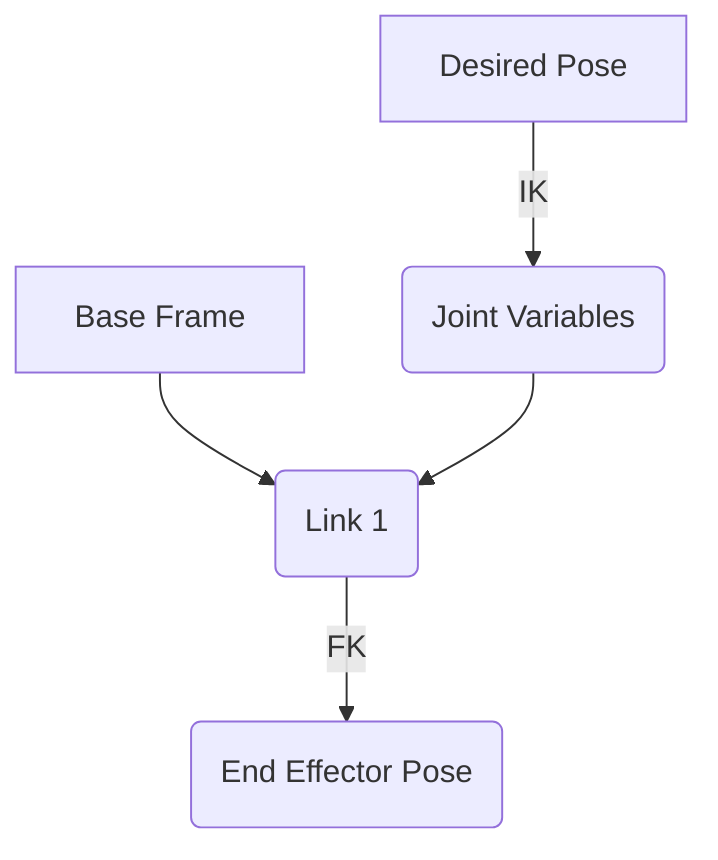

# Forward and Inverse Kinematics in Robotics

## Introduction

This chapter delves into the fundamental concepts of Forward Kinematics (FK) and Inverse Kinematics (IK) for robotic manipulators. Understanding these principles is essential for predicting the end-effector's pose given joint states (FK) and for determining the joint configurations required to achieve a desired end-effector pose (IK).

## 1. Forward Kinematics (FK)

Forward Kinematics is the process of calculating the end-effector's position and orientation in Cartesian space, given the joint variables (angles for revolute joints, displacements for prismatic joints).

### 1.1. FK for a Single Joint

*   For a single revolute joint, FK determines the end-effector's orientation around the joint axis.
*   For a single prismatic joint, FK determines the end-effector's linear displacement along the joint axis.

### 1.2. FK for a Multi-DOF Manipulator

*   The total FK of a manipulator is found by composing the transformations of individual joints.
*   This involves multiplying transformation matrices from the base frame to the end-effector frame.

## 2. Inverse Kinematics (IK)

Inverse Kinematics is the process of calculating the required joint variables to achieve a desired end-effector pose (position and orientation) in Cartesian space. This is generally a more complex problem than FK.

### 2.1. The Challenge of IK

*   IK problems can have multiple solutions, a single solution, or no solution (if the target pose is outside the workspace).
*   Computational methods vary in complexity and accuracy.

### 2.2. Analytical vs. Numerical IK

*   **Analytical IK**: Solvable for simpler robots with closed-form solutions (e.g., some 6-DOF arms). Faster and exact.
*   **Numerical IK**: Uses iterative methods (e.g., Jacobian-based methods, optimization) to find solutions. Applicable to more complex robots but can be slower and may find local minima.

## 3. Kinematic Chains and Representations

Representing the robot's structure is key to solving kinematic problems.

### 3.1. Homogeneous Transformation Matrices

*   Used to represent the position and orientation of one coordinate frame with respect to another.
*   A 4x4 matrix combining rotation and translation.

### 3.2. Denavit-Hartenberg (DH) Convention

*   A standard method for assigning coordinate frames to the links of a serial-link manipulator and describing transformations between them.
*   Uses four parameters per link.

## 4. Visualizing Kinematics

*(Placeholder for Mermaid diagram showing a kinematic chain and transformations)*



## 5. Python Code Examples

Example of calculating FK for a simple 2-DOF arm:

```python
import numpy as np

def forward_kinematics_2d_planar(joint_angles, link_lengths):
    """
    Calculates the end-effector position for a 2D planar arm.
    Assumes revolute joints.
    """
    l1, l2 = link_lengths
    theta1, theta2 = joint_angles

    # Transformation for link 1 (simplified)
    T1 = np.array([
        [np.cos(theta1), -np.sin(theta1), 0, l1 * np.cos(theta1)],
        [np.sin(theta1), np.cos(theta1), 0, l1 * np.sin(theta1)],
        [0, 0, 1, 0],
        [0, 0, 0, 1]
    ])

    # Transformation for link 2 (simplified)
    T2 = np.array([
        [np.cos(theta2), -np.sin(theta2), 0, l2 * np.cos(theta2)],
        [np.sin(theta2), np.cos(theta2), 0, l2 * np.sin(theta2)],
        [0, 0, 1, 0],
        [0, 0, 0, 1]
    ])

    # Total transformation T_0_2 = T1 @ T2
    T_0_2 = T1 @ T2

    # End effector position is the translation part of the final matrix
    end_effector_pos = T_0_2[:2, 3]
    return end_effector_pos

# Example usage
# joint_angles = [np.pi/4, np.pi/4] # 45 degrees for both joints
# link_lengths = [1.0, 1.0]
# position = forward_kinematics_2d_planar(joint_angles, link_lengths)
# print(f"End effector position: {position}")
```

## 6. ROS 2 Snippets

*(Placeholder for ROS 2 concepts related to kinematics, e.g., using MoveIt! for IK, or TF for transformations)*

```python
# Conceptual ROS 2 snippet for requesting an IK solution
# In a real ROS 2 application, you would use action clients or services
# to interact with an IK solver.

# import rclpy
# from rclpy.node import Node
# from moveit_msgs.action import MoveGroupInterface
# from geometry_msgs.msg import PoseStamped

# class RobotCommander(Node):
#     def __init__(self):
#         super().__init__('robot_commander')
#         # ... initialize action client for MoveGroupInterface ...

#     def send_ik_goal(self, target_pose):
#         goal_msg = MoveGroupInterface.Goal()
#         goal_msg.request.goal_constraints[0].position = target_pose.position
#         goal_msg.request.goal_constraints[0].orientation = target_pose.orientation
#         # ... set other goal constraints ...
#         # ... send goal and wait for result ...
#         print("Sent IK goal to MoveIt!")

# # Example of how you might use it:
# # commander = RobotCommander()
# # desired_pose = PoseStamped() # Define a target pose
# # # ... fill desired_pose ...
# # commander.send_ik_goal(desired_pose)
```

## Practice Questions

1.  Explain the primary goal of Forward Kinematics and Inverse Kinematics.
2.  What are the key differences between analytical and numerical IK solutions?
3.  How does the number of DOFs affect the complexity of an IK problem?
4.  Describe the components of a homogeneous transformation matrix.
5.  What is the main advantage of using DH parameters for representing robot kinematics?
6.  When might a robot require more than 6 DOFs for its tasks?
7.  (Advanced) Discuss the challenges in solving IK for redundant robot manipulators.