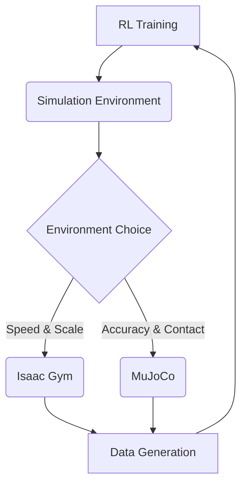

# Training in Isaac Gym and MuJoCo

## Introduction

This chapter focuses on the practical aspects of training robotic agents using advanced simulation environments. We will explore two powerful platforms: NVIDIA Isaac Gym for high-performance parallelized RL, and MuJoCo for accurate physics simulation. Understanding how to use these tools effectively is crucial for bridging the sim-to-real gap and developing robust robotic policies.

## 1. NVIDIA Isaac Gym

Isaac Gym is a highly parallelized, GPU-accelerated RL environment designed for fast simulation and large-scale training.

### 1.1. Key Features

*   **Massively Parallel Simulation**: Capable of running thousands of environments simultaneously on a single GPU.
*   **GPU Acceleration**: Leverages the GPU for physics computations, enabling rapid data generation.
*   **Python API**: Offers a user-friendly Python interface for defining robots, tasks, and training loops.

### 1.2. Use Cases

*   Rapid policy iteration for RL agents.
*   Large-scale hyperparameter tuning.
*   Curriculum learning.

## 2. MuJoCo (Multi-Joint dynamics with Contact)

MuJoCo is a physics engine renowned for its accuracy and efficiency in simulating complex contact dynamics, making it suitable for tasks requiring high-fidelity physics.

### 2.1. Key Features

*   **Accurate Physics Simulation**: Excellent for modeling contact, friction, and complex physical interactions.
*   **Real-time Performance**: Optimized for fast simulation cycles.
*   **Python Bindings**: Provides Python interfaces for integration into ML workflows.

### 2.2. Use Cases

*   Robotics tasks requiring precise contact simulation (e.g., manipulation, assembly).
*   Research requiring high-fidelity physical interactions.
*   Benchmarking RL algorithms against accurate physics.

## 3. Setting Up and Running Examples

Guidance on how to set up and run basic examples in both environments.

### 3.1. Isaac Gym Setup

*   Installation instructions (typically via NVIDIA Omniverse or specific packages).
*   Running a basic robot arm simulation.

### 3.2. MuJoCo Setup

*   Installation and licensing information.
*   Running a simple pendulum or robotic hand example.

## 4. Visualizing Training Environments

*(Placeholder for Mermaid diagram comparing Isaac Gym and MuJoCo)*



## 5. Python Code Examples

Example of setting up a simple robot in a physics engine (conceptual, using MuJoCo's API style):

```python
import mujoco as mj # Hypothetical import for MuJoCo
import numpy as np

# Assume a robot model is loaded from an XML file
# model = mj.MjModel.from_xml_path('robot.xml')
# data = mj.MjData(model)

def simulate_robot_step(data, action):
    """
    Applies actions and steps the simulation for one timestep.
    """
    # Set joint torques or positions based on RL action
    data.ctrl[:] = action # Simplified: directly apply action as control signal

    # Step the physics simulation
    mj.mj_step(model, data)
    
    # Return new state and reward (simplified)
    new_state = data.qpos # Joint positions as state
    reward = -np.sum(np.square(action)) # Dummy reward: penalizes large actions
    return new_state, reward

# Example loop structure
# num_steps = 1000
# for _ in range(num_steps):
#     current_state = data.qpos # Get current state
#     rl_action = agent.choose_action(current_state) # Agent decides action
#     next_state, reward = simulate_robot_step(data, rl_action)
#     agent.learn(current_state, rl_action, reward, next_state)
#     data.time += model.opt.timestep
```

## 6. ROS 2 Snippets

*(Placeholder for ROS 2 concepts related to interfacing with simulation environments, e.g., ROS wrappers for Isaac Gym or MuJoCo, or using ROS 2 for controlling simulated robots)*

```python
# Conceptual ROS 2 snippet for interfacing with a simulator
# This would involve ROS 2 nodes for physics simulation or sensor data.

# import rclpy
# from rclpy.node import Node
# from sensor_msgs.msg import JointState
# from trajectory_msgs.msg import JointTrajectory

# class SimInterfaceNode(Node):
#     def __init__(self):
#         super().__init__('sim_interface_node')
#         self.joint_state_pub = self.create_publisher(JointState, '/sim_joint_states', 10)
#         self.trajectory_sub = self.create_subscription(
#             JointTrajectory, '/robot_trajectory_command', self.trajectory_callback, 10)
#         self.simulator = None # Initialize with Isaac Gym or MuJoCo simulator instance

#     def trajectory_callback(self, msg):
#         if msg.points:
#             # Assume taking the first point for simplicity
#             point = msg.points[0]
#             joint_commands = point.positions # Or efforts/velocities
#             # Send commands to the simulator
#             # self.simulator.set_joint_positions(joint_commands) 
#             # self.simulator.step()
#             # Publish new joint states from simulator
#             # ... publish to /sim_joint_states ...

# # Usage: Run this node to send commands to a connected simulator.
```

## Practice Questions

1.  What are the main advantages of using NVIDIA Isaac Gym for RL training?
2.  When would you choose MuJoCo over Isaac Gym for a robotics simulation task?
3.  Describe the concept of "domain randomization" in the context of sim-to-real transfer.
4.  What are the key challenges of the "sim-to-real gap"?
5.  Describe a scenario where Sim-to-Real transfer is particularly important.
6.  How does Domain Randomization help a policy generalize?
7.  (Advanced) What is "domain adaptation" and how does it differ from Domain Randomization?