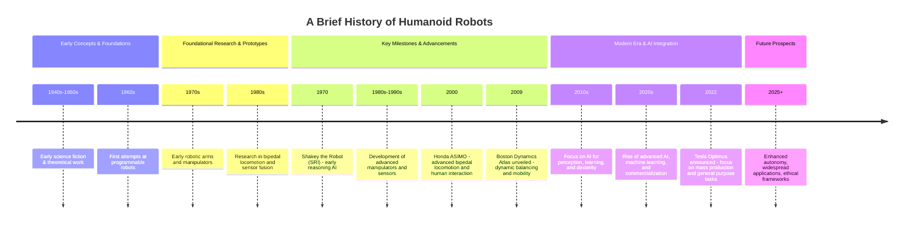

# Welcome to the World of Physical AI and Humanoid Robots

This document provides a foundational overview of Physical AI and humanoid robots, exploring their unique characteristics, historical trajectory, burgeoning applications, and future potential. We aim to demystify this exciting field for both students and engineers, offering insights into the core concepts, key players, and the transformative impact these technologies are poised to have.

## Overview (Approx. 900-1200 words)

Physical AI represents a paradigm shift from disembodied intelligence to embodied agents capable of directly interacting with the physical world. Unlike traditional AI, which often operates within digital or simulated environments, Physical AI is concerned with intelligence manifested in a physical form – most notably, humanoid robots. These systems integrate perception, cognition, and action to navigate, manipulate, and learn within the complex dynamics of the real world. Humanoid robots, specifically designed to mimic human form and capabilities, are at the forefront of this field, promising unprecedented levels of human-robot collaboration and autonomy. This overview will delve into the distinctions, historical evolution, the rationale behind humanoid design, critical industry players, diverse applications, and the projected future trajectory, including societal and ethical considerations. Understanding this domain is crucial for anyone looking to contribute to or understand the next wave of technological advancement.

## Differences from Traditional AI

Traditional AI, often exemplified by large language models or recommendation engines, primarily operates within computational or data-driven environments. Its strengths lie in pattern recognition, prediction, and information processing based on vast datasets. Physical AI, however, extends intelligence into the physical realm. It necessitates not only cognitive capabilities but also robust perception systems to interpret real-world sensory data (vision, touch, sound), sophisticated control mechanisms for physical actuation (movement, manipulation), and the ability to learn and adapt through direct interaction with the environment. While traditional AI might predict user preferences, Physical AI might need to predict the trajectory of a falling object or adapt its grip to an unknown item. Embodiment introduces constraints and opportunities unique to physical interaction, requiring real-time decision-making under uncertainty and physical limitations.

## History of Humanoid Robots

The journey towards sophisticated humanoid robots is a long and fascinating one, marked by incremental advancements and ambitious leaps. Early conceptualizations existed in mythology and early science fiction, but the practical journey began with early robotics research. Shakey the robot at SRI in the late 1960s was one of the first mobile robots to reason about its actions, albeit primitive. Decades of research in bipedal locomotion, manipulation, and AI integration followed. Significant milestones include early bipedal robots like Honda's ASIMO in the early 2000s, demonstrating remarkable balance and movement capabilities. More recently, advancements in AI, sensor technology, and material science have propelled the field forward dramatically. Companies like Boston Dynamics have showcased incredible mobility and agility with robots like Atlas, while Tesla's Optimus aims to bring humanoid robots into industrial and potentially domestic settings, representing a new era of practical, mass-producible humanoid systems.

## Why Humanoids?

The humanoid form factor is not merely an aesthetic choice; it is driven by compelling functional and practical advantages. Designing robots that resemble humans allows them to operate in environments built for humans, utilizing human tools and infrastructure. This form factor is advantageous for tasks requiring dexterity, manipulation, and navigation in complex, unstructured human-centric spaces. Humanoids can potentially perform a wide range of tasks, from industrial assembly and logistics to elder care and household chores, by leveraging their human-like manipulation and mobility. Furthermore, a humanoid form can facilitate intuitive human-robot interaction, as humans may find it easier to communicate with and understand the intentions of a robot that shares a familiar form.

## Industry Leaders

The field of humanoid robotics is being shaped by several pioneering companies and research institutions. **Boston Dynamics** has long been renowned for its advanced robots showcasing exceptional mobility, balance, and agility, exemplified by their Atlas robot. **Tesla**, with its Optimus project, is pushing towards mass-producible humanoid robots intended for a broad range of applications, aiming to integrate advanced AI capabilities. Other significant players include **Agility Robotics** (with Digit), **Figure AI**, and historical contributors like **Honda** (ASIMO), alongside numerous academic institutions and research labs worldwide, all contributing to the rapid progress in this domain.

## Applications

Humanoid robots are poised to revolutionize numerous sectors. In **home assistance**, they could aid the elderly with daily tasks, provide companionship, or manage household chores, enhancing quality of life and independence. In **healthcare**, humanoid robots can assist with patient care, rehabilitation, performing delicate surgeries, or acting as diagnostic tools. Beyond these, potential applications span manufacturing (performing repetitive or dangerous tasks), logistics (warehousing and delivery), exploration (hazardous environments), and even education. The versatility of the humanoid form factor makes it a compelling candidate for a wide array of future roles.

## Future Outlook

The future of Physical AI and humanoid robots is incredibly promising, characterized by rapid advancements in AI, sensor technology, battery life, and manipulation capabilities. We anticipate increasingly sophisticated robots capable of more nuanced human interaction, complex task execution, and robust adaptation to dynamic environments. Ethical considerations regarding safety, employment displacement, privacy, and the human-robot relationship will become increasingly critical as these technologies integrate more deeply into society. The potential for these embodied intelligences to augment human capabilities, address labor shortages, and explore new frontiers is immense, marking a transformative era in our relationship with technology.

## Timeline of Humanoid Robotics

Mermaid timeline visualization would go here. For example:

## Robot Comparison Table

A table comparing notable humanoid robots.

| Robot/System | Manufacturer | Key Features | Primary Application Area | Significant Year |
|--------------|--------------|--------------|--------------------------|-------------------|
| Optimus      | Tesla        | AI-powered, general-purpose, mass-producible | Home assistance, logistics, industry | 2022 (announced) |
| Atlas        | Boston Dynamics | Advanced mobility, dynamic balancing, dexterity | Research, rescue, advanced demos | 2009 (evolved) |
| ASIMO        | Honda        | Bipedal locomotion, human interaction | Research, public relations | 2000 |
| Digit        | Agility Robotics | Bipedal, dexterous manipulation, warehouse tasks | Logistics, warehouse operations | 2019 |
| SG-5         | Figure AI    | General-purpose humanoid, AI-driven | Warehouse, manufacturing, potential home use | 2024 (announced) |
| TALOS        | PAL Robotics | Dexterous manipulation, humanoids for research | Research, industry, hazardous environments | 2013 |

*Note: This table provides a snapshot; specifications and capabilities evolve rapidly.*